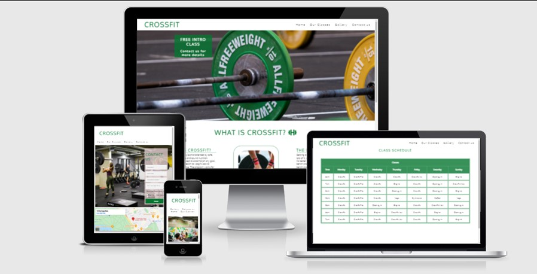
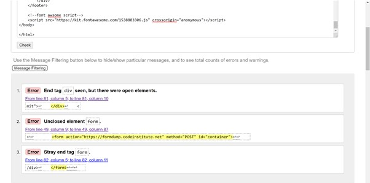
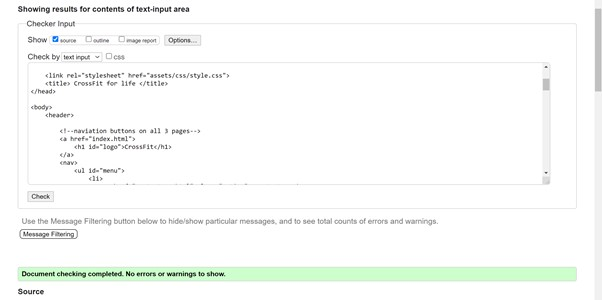
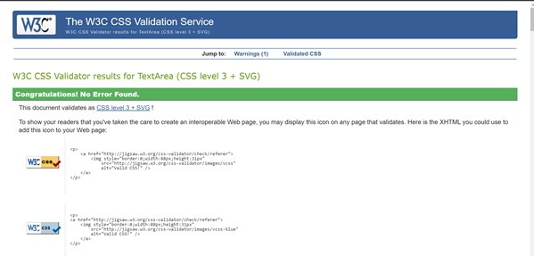
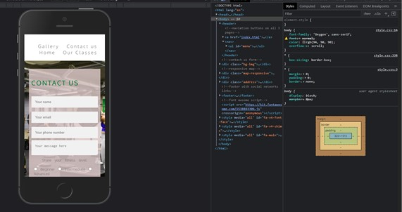
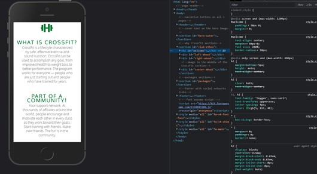
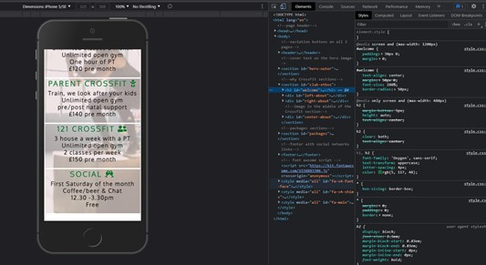
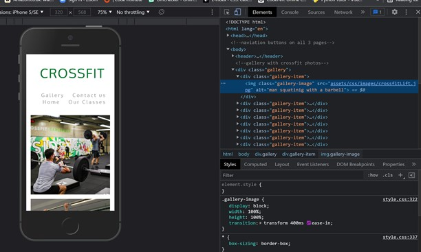
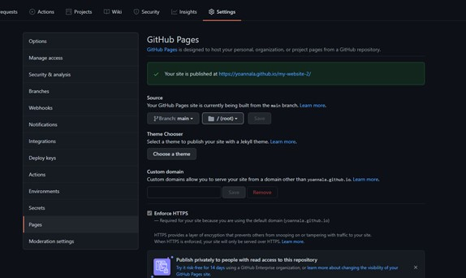
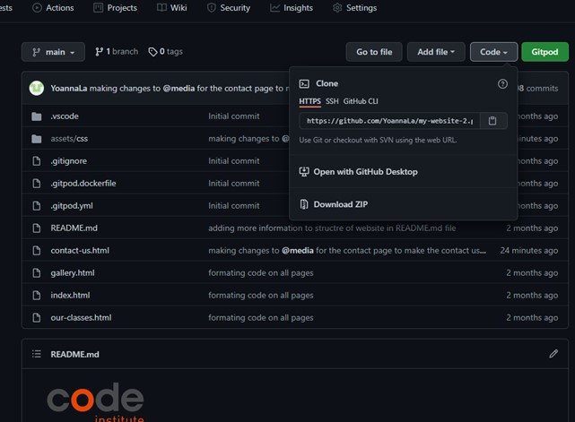

<!DOCTYPE html>

# CrossFit - a website for a local crossfit gym

View live version of website via GitHub Pages (https://yoannala.github.io/my-website-2/)

# Table of contents

## Website owner business goals
## User goals
## Structure of the website
## Wireframes
## Surface
## Technology
## Testing
### Validation testing
### Functionality testing
### Compatibility testing
## Bugs and issues found during site development
## Performance testing
## Deployment
## Features

This website was created for a new gym in Mayfair area. It introduces the user to a new way of keeping fit while becoming a part of a community.  Show few benefits of CrossFit  is the great place for someone with zero fitness experience to be introduce to this form of exercise. Also, this site is a perfect place to get in touch and book a free intro class to experience CrossFit first hand.

## Website owner business goals
* introducing user to CrossFit
* creating "traffic" and interest in a new way of exercise
* using the free intro class to find new members

## User goals
* user can be learn about a CrossFit and become a part of the community especially during Covid time
* user is given look-in what the gym is like by visiting the gallery 
* user can send a message if interested in a free introduction class or other query in a form provided 

## Structure of the website
The website was created to introduce the user to CrossFit gym in Mayfair. There is 4 pages with navigation buttons on each page, class schedule and form to contract us for more information. There is also a interactive map to make finding the gym easier.

## Wireframes
* Initial draft of how the website should look like, I've changed few things as I've learn more about html and css. I wanted the site to be easy to navigate, available on all devices, informative and user friendly.

## Surface
### Colors/fonts :
* Some of the text on the main page was taken from (https://www.crossfit.com/)
* Main font-family: 'Oxygen', sans-serif; secondary:'Roboto'
* Font: normal;
* Color: green rgb(94, 90, 90);
* Google fonts: as a font resource

### Sources 
* I've used the following website for images, text, codes, etc,
(https://unsplash.com/s/photos/crossfit), (https://www.crossfit.com/), (https://www.w3schools.com/), (https://developer.mozilla.org/), (https://codepen.io/), (https://learn.codeinstitute.net/), 
*  I've asked my mentor and fellow students to help. Also I've an inspiration from the website in my local crossfit gym (https://parksidegym.com/)

## Technology
* HTML - structure language
* CSS - style language

## Testing
### Validator testing
* HTML - 3 errors when code pass the W3C validator, there was an issue with the “form”/”div” closing tags, I've changed the order of the closing tags for  form and div and the issue got fix and resulted in no error when put thou the W3C validator.

* CSS - No errors were found when passing through the official (jigsaw) validator

### Functionality testing
* I've used the chrome developers tools to test and solving problems with style, social links and responsiveness and sent the link to the website to few of my friends so they can check the functionality on different devices 

### Compatibility testing
* I've tested the website across few different devices and browsers, and it seems to be working fine, easy to read and use.
* I've used this website to check responsive of my website (http://ami.responsivedesign.is/)
* Also I've used the inspect function to check how the pages behave on different screen sizes.

## Bugs and issues found during site development
I had a few issues with developing this side, took me ages to sort out the form, only today (31.07) I've realised that there week a video on gitpod, all this time i was relaying on google and friends help... Lesson learn.
1. The biggest issue I had in this development was the media query for phone size; details below: 
2. I had an issue with the contact form on the last page - The "container" hasn't fit a mobile sized screen. I have now removed the "with" option in css file for the full screen. I've added margin and with at 80% of the screen. Also the "Contact us" paragraph is now proportion. I have fixed that issue with 'inspect' function and play around the "container" size and location of the form. I wanted the form to be in the middle of the small screen (mobile) so set up the margins and correct size. Also since the form is located on the image, I've adjusted the size of the image too.

3. Another issue I found was in the “index page” as the paragraphs didn’t fit the small screen. I’ve used the “inspect” function and made changes to css to make the fit and be more users friendly

4. The similar approach was taken with the packages on “index” page as those did not fit easily on the mobile phone device. 

5. My schedule page - I really wanted to make it week by week and have at least a month with buttons next and previous, but my skills are not there yet.

6. I've also had a issue with the gallary to fit nicely on mobile phone device. I have changed the width of the gallery in css in media query. I've used the inspect function to find the best solutions.

## Performance testing
I've used (https://developers.google.com/speed/pagespeed/insights/) to test the speed of the website on mobile and destop. 

## Deployment
* The website was deployed to GitHub pages.
I used GitPod as a development environment where I committed all changes to git and push command to GitPod for the changes go be saved.

To deploy this project I had to:

Log in to GitHub and click on the right repository to deploy (my-website-2), I've 
selected "Settings" and found GitHub Pages section.("Pages settings now has its own dedicated tab! Check it out here!")
from source I've select branch to main and then saved the page so it could be deployed.
My site is published at https://yoannala.github.io/my-website-2/

To run my project locally:

Log in to GitHub and click on the repository to download (my-website-2)
select Code icon to Download the ZIP file.
after download I was able can save the file and use it in my local environment
The other way is to Clone or/and Fork this repository (my-website-2) into my GitHub account.
The link can be found: https://github.com/YoannaLa/my-website-2

## Features

### Navigation bar
* Features on all 4 pages, the full responsive naviagation bar inculdes links to the Home, Our Classes, Gallery and Contact Us page. The navigation bar is identical in each page for easy navigation 
* The active page has a line underneath for easy user experience

### Home page image
* The home page include a image with text overlay informing of a free introduction class
* The image includes animation effect

  

### Club Ethos Section
* This section explains what is CrossFit and the big 3, becoming a part of community and it's a covid safe environment

### Packages 
* Three different package options to choose from and information regarding a social event every month

### Footer
* Footer section contains links to social media, including Facebook, Twitter and Instagram, which opens in new taps
* Those links provide more information regarding CrossFit and the community

### Our Classes
* A simple table with the weekly schedule of classes 

### Gallery
* This page provides the user with supporting images to give them a better idea of what CrossFit is
* People of different ages, fitness and abilities, hopefully to inspire a new members

### Contact us
* A last page is a page where the user can contract the gym and ask questions or simply book a free intro class
* This page also contains a map, full address and phone number 

