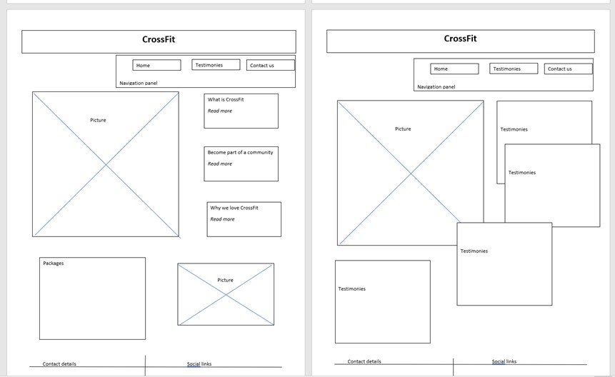
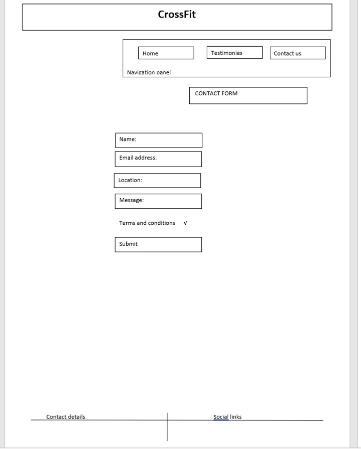
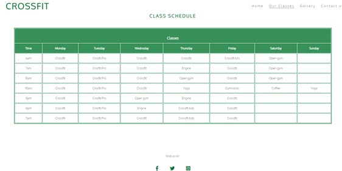
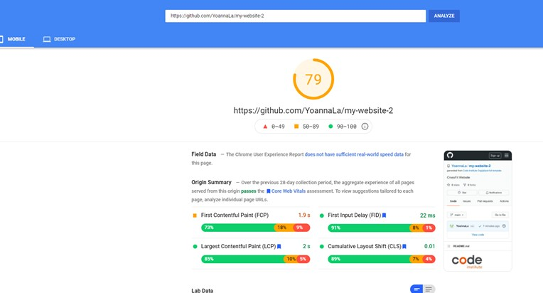
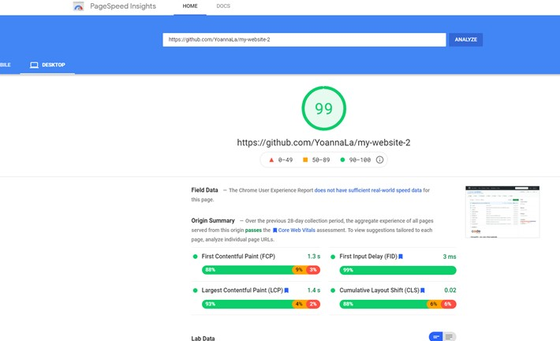
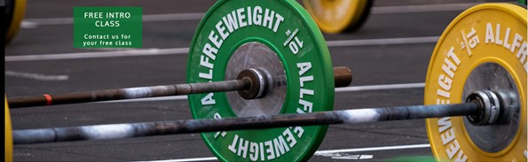
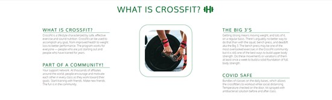
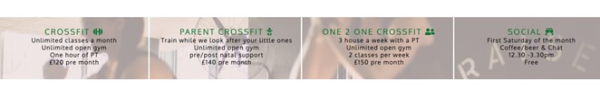
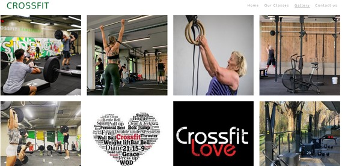
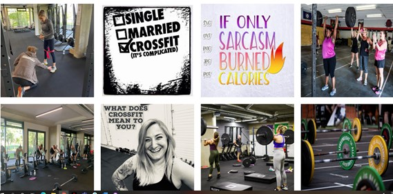

# CrossFit - my very first website

This website was created for a new gym in Mayfair area. It introduce the user to a new way of keeping fit while becoming a part of a community.  Show few benefits of CrossFit  is the great place for someone with zero fitness experience to be introduce to this form of exercise. Also, this site is a perfect place to get in touch and book a free intro class to experience CrossFit first hand.

# Table of contents
## UX
### Website owner business goals
### User goals
## Structure of the website
## Wireframes
## Surface
## Features
## Technology
## Testing
### Functionality testing
### Compatibility testing
### Code Validation
### Issues found during site development
### Performance testing
## Deployment
## Credits
## Screenshots

### Website owner business goals
* introducing user to CrossFit
* creating "traffic" and intrest in a new way of exercise
* using the free intro class to find new members

### User goals
* user can be learn abouth a CrossFit and become a part of the community especially during Covid time
* user is able to check out the gallery 
* user can send a message if interested in a free introduction class or other query in a form provided 

## Structure of the website
The website is created to be easy and user-friendy on all type of devices. All parts are designed to achieve high user satisfaction, with four pages with easy navigation buttons, 

## Wireframes

## Surface
### Colors/fonts :
* Main font-family: 'Oxygen', sans-serif; secondary:  font-family: 'Roboto'
* font: normal;
* color: green rgb(94, 90, 90);
* Google fonts: as a font resource

### Sources 
* I've used the following website for images, text, codes, etc,
(https://unsplash.com/s/photos/crossfit), (https://www.crossfit.com/), (https://www.w3schools.com/), (https://developer.mozilla.org/), (https://codepen.io/)

## Technology
* HTML - structure language
* CSS - style language

# Testing
## Validator testing
* HTML - No errors were found when passing through the offical W3C validator
* CSS - No errors were found when passing through the offical (jigsaw) validator

### Functionality testing
* I've used the chrome developers tools to test and solving problems with style, links and responsiveness

### Compatibility testing
* I've tested the website across few different devices and browsers, I coudn't work out the media for a phone to sort out the Contact Us title. Would love to find out the right way to do it. 

### Issues found during site development
* I had a few issues with devloping this side, took me ages to sort out the form, only today (31.07) I've realised that there wee a videos on gitpod, all this time i was relaying on google and friends help... Lesson learn.

* My schedule page - I really wanted to make it week by week and have at least a month with buttons next and previous, but my skills are not there yet.

## Deployment
* The website was deloyed to GitHub pages.

## Performance testing
I've used (https://developers.google.com/speed/pagespeed/insights/) to test the speed of the website on mobile and destop. 

# Features

## Existing Features
### Navigation bar
* Features on all 4 pages, the full responsive naviagation bar inculdes links to the Home, Our Classes, Gallery and Contact Us page. The navigation bar is identical in each page for easy navigation 
* The active page has a line underneath for easy user experience

### Home page image
* The home page include a image with text overlay informing of a free introduction class
* The image includes animation effect

  

### Club Ethos Section
* This section explain what is CrossFit and the big 3, becoming a part of community and it's a covid safe environment

### Packages 
* Three different package options to choose from and information regarding a social event every month

### Footer
* Footer section contains links to social media, including Facebook, Twitter and Instagram, which opens in new taps
* Those links provide more information regarding CrossFit and the community

### Our Classes
* A simple table with the schedule of classes 

### Gallery
* This pagea provide the user with supporing images to give them a better idea of what CrossFit is
* People of different ages, fittness and abilities, hopefully to inspire a new members

### Contact us
* A last page is a page where the user can contract the gym and ask questions or simply book a free intro class
* This page also contains a map, full address and phone number 

