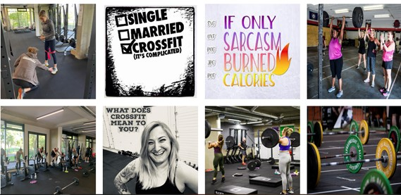
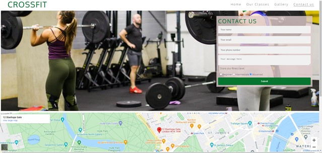

# CrossFit - my very first website

This website was created for a new gym in Mayfair area. It introduce the user to a new way of keeping fit while becoming a part of a community.  Show few benefits of CrossFit  is the great place for someone with zero fitness experience to be introduce to this form of exercise. Also, this site is a perfect place to get in touch and book a free intro class to experience CrossFit first hand.

# Features

## Existing Features
### Navigation bar
* Features on all 4 pages, the full responsive naviagation bar inculdes links to the Home, Our Classes, Gallery and Contact Us page. The navigation bar is identical in each page for easy navigation 
* The active page has a line underneath for easy user experience

### Home page image
* The home page include a image with text overlay informing of a free introduction class
* The image includes animation effect

  

### Club Ethos Section
* This section explain what is CrossFit and the big 3, becoming a part of community and it's a covid safe environment

### Packages 
* Three different package options to choose from and information regarding a social event every month

### Footer
* Footer section contains links to social media, including Facebook, Twitter and Instagram, which opens in new taps
* Those links provide more information regarding CrossFit and the community

### Our Classes
* A simple table with the schedule of classes 

### Gallery
* This pagea provide the user with supporing images to give them a better idea of what CrossFit is
* People of different ages, fittness and abilities, hopefully to inspire a new members

### Contact us
* A last page is a page where the user can contract the gym and ask questions or simply book a free intro class
* This page also contains a map, full address and phone number 

# Testing
## Validator testing
* HTML - No errors were found when passing through the offical W3C validator
* CSS - No errors were found when passing through the offical (jigsaw) validator

### Club Ethos Section
* This section explain what is CrossFit and the big 3, becoming a part of community and it's a covid safe environment

### Packages 
* Three different package options to choose from and information regarding a social event every month

### Footer
* Footer section contains links to social media, including Facebook, Twitter and Instagram, which opens in new taps
* Those links provide more information regarding CrossFit and the community

### Our Classes
* A simple table with the schedule of classes 

### Gallery
* This pagea provide the user with supporing images to give them a better idea of what CrossFit is
* People of different ages, fittness and abilities, hopefully to inspire a new members

### Contact us
* A last page is a page where the user can contract the gym and ask questions or simply book a free intro class
* This page also contains a map, full address and phone number 

# Testing
## Validator testing
* HTML - No errors were found when passing through the offical W3C validator
* CSS - No errors were found when passing through the offical (jigsaw) validator
